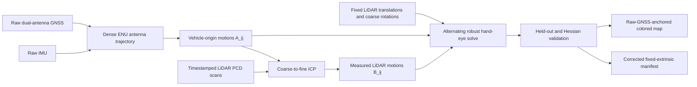

# Raw-IMU/GNSS fixed-translation multi-LiDAR rotation calibration

This is the canonical description of the repository's offline calibration prototype for a planar vehicle rig. Dataset-specific measurements are kept in
the [AIV5 raw-sensor report](../aiv5_raw_imu_gnss_10deg_results.md), while commands and artifact handling are in the [offline operation guide](../../estimator/offline/README.md).

The complete frame-by-frame derivation, expanded hand-eye equations, Jacobians, and planar observability argument are in the
[mathematical establishment](fixed_translation_planar_multi_lidar_calibration_math.md).

Implementation:
[`planar_nav_rotation_calibrator.py`](../../estimator/offline/tools/planar_nav_rotation_calibrator.py)

## 1. Design decision and data boundary

The target rig has precise LiDAR translations in the vehicle frame, but its LiDAR rotations may initially be wrong by about 10 degrees. The vehicle motion
is predominantly planar. The estimator therefore solves only the three rotational degrees of freedom of every `vehicle_T_lidar` transform and copies
each supplied translation exactly.

The navigation trajectory is constructed only from:

- raw accelerometer and gyroscope samples in `imu.txt`; and
- raw GNSS records in `gnss/*.prototxt`: WGS84 position, ENU velocity, and dual-antenna RTK heading.

The implementation intentionally does not read the LiDAR-localizer vehicle pose stream, the final INS text result, or the incomplete wheel result. It has
no command-line argument for any of those sources. This avoids using a pose whose generation already depends on precise LiDAR calibration.

This is not the MLCC-style backend. It is a calibration stage that writes a fixed-extrinsic manifest with the joint backend disabled.

## 2. Why the constrained problem is observable

An unconstrained six-degree-of-freedom extrinsic solve is poorly conditioned under nearly planar motion. Weak roll and pitch excitation allows rotation and translation to compensate for one another. Fixing the measured translations removes that ambiguity.

The rig also has long, diverse LiDAR lever arms. During a turn, an incorrect rotation predicts the wrong LiDAR-frame translation even when the vehicle
origin follows the correct planar trajectory. The known lever arms therefore make rotation strongly observable from the translational part of the hand-eye equation. ICP rotation and scene geometry add information about the other axes.

The current AIV5 sequence contains about 153 m of travel and 116 degrees of accumulated yaw, including motion in more than one direction. That is enough for this fixed-translation problem. It is not evidence that arbitrary planar data can identify a full six-degree-of-freedom extrinsic.

## 3. Frames and transform convention

`A_T_B` maps a point expressed in frame `B` into frame `A`.

| Symbol | Meaning |
|---|---|
| `W_T_V(k)` | vehicle pose in the local ENU world at time `k` |
| `X_l = V_T_L(l)` | vehicle-to-LiDAR extrinsic for LiDAR `l` |
| `R_l, t_l` | optimized rotation and fixed translation of `X_l` |
| `W_T_G(k)` | GNSS antenna pose, with axes aligned to the vehicle axes |
| `g = V_t_G` | shared GNSS antenna lever arm expressed in the vehicle frame |
| `A_ij` | vehicle-origin motion `inverse(W_T_V(i)) * W_T_V(j)` |
| `B_ij` | LiDAR motion from scan `j` into scan `i`, measured by ICP |

Rigid motion gives the hand-eye relationship

```text
B_ij = inverse(X_l) * A_ij * X_l.
```

A LiDAR point is placed into the ENU map as

```text
p_W = W_T_V(k) * V_T_L(l) * p_L.
```

## 4. Pipeline



All LiDARs share the same independently measured rig motion. Direct scan overlap between every pair of LiDARs is not required. Relative LiDAR-to-LiDAR
extrinsics are derived after the vehicle-frame rotations have been estimated.

## 5. Raw navigation construction

### 5.1 GNSS position

Usable raw GNSS records are sorted independently by their position and heading timestamps. Latitude, longitude, and altitude are converted through WGS84 ECEF to a local ENU frame about the first valid fix. Position is interpolated to the IMU timestamps with a cubic Hermite spline whose endpoint derivatives are the measured ENU velocities. This preserves the globally referenced GNSS path without importing a downstream navigation solution.

The run is rejected if there are fewer than 20 usable position records or a position gap exceeds one second.

### 5.2 Stationary IMU initialization

Samples are considered stationary when interpolated GNSS speed is below 0.10 m/s and accelerometer magnitude is between 8.0 and 11.5 m/s^2. At least 50 such samples are required. Their median gyroscope value initializes the constant gyro bias, and median gravity supplies one fixed roll/pitch attitude for this planar model.

The prototype assumes the IMU axes and vehicle axes have compatible roll/pitch conventions. A known IMU-to-vehicle rotation should replace this
assumption on a rig where they are not aligned.

### 5.3 High-rate yaw fusion

Bias-corrected gyro-z is trapezoidally integrated at the IMU rate. A robust two-parameter fit estimates a constant heading offset and a residual linear
gyro drift against the raw dual-antenna GNSS headings:

```text
yaw_H(t) = integral(gyro_z - stationary_bias) + c0 + c1 * (t - t0).
```

The fit uses a Cauchy loss and honors the GNSS heading timestamp separately from the position timestamp. GNSS heading is therefore an absolute,
low-frequency anchor while gyro-z supplies smooth high-rate relative yaw.

### 5.4 Heading-frame mounting yaw

Dual-antenna heading is not necessarily the vehicle x direction. The best input is a measured constant mounting yaw supplied with
`--gnss-heading-to-vehicle-yaw-deg`.

When that value is unavailable, the prototype estimates it from raw GNSS velocity during samples with speed at least 2 m/s and absolute yaw rate no
more than 0.02 rad/s:

```text
heading_to_vehicle_yaw = circular_mean(course_ENU - dual_antenna_heading).
```

This fallback does not consume wheel speed, steering angle, or a vehicle model, but it does make one weak nonholonomic assumption: during selected
straight segments, sideslip is small enough that GNSS course is the vehicle x direction. At least 20 samples are required and the robust alignment p95 must be no more than 5 degrees. If even that assumption is disallowed, the mounting yaw must be measured; it is not observable from raw heading labels alone.

### 5.5 Unknown GNSS antenna lever arm

GNSS positions describe an antenna, not the vehicle origin. Treating them as the vehicle origin creates a turn-dependent translation error. The prototype
therefore estimates one shared planar antenna lever arm

```text
g = [g_x, g_y, 0].
```

If `A_G` is antenna-origin motion expressed with vehicle-aligned axes, the corresponding vehicle-origin motion is

```text
A_V = T(g) * A_G * inverse(T(g)).
```

The vertical component is fixed because planar motion cannot reliably identify it. This nuisance parameter changes the navigation reference point;
it does not change any supplied LiDAR translation.

## 6. Motion-pair selection and ICP

For each LiDAR, candidate scans must lie inside raw-navigation coverage. With the defaults, the tool examines every fifth start scan, pairs it with a scan 15
frames later, retains 0.8--6.0 m motions, ranks them by `rotation_deg + 0.2 * translation_m`, and keeps the best 40. This favors turns while excluding stationary and excessively long registrations.

The coarse extrinsic and raw navigation predict the initial LiDAR motion. The scan at `j` is registered into the scan at `i` with three-stage Open3D
point-to-plane ICP. Points outside 2--80 m are removed, clouds are voxelized at 0.45 m, and normals are estimated locally. Correspondence distances are four, two, and one voxel widths.

A measured motion is retained only if:

| Gate | Default |
|---|---:|
| ICP fitness | at least 0.25 |
| ICP inlier RMSE | at most 0.8 m |
| Translation correction from prediction | at most 2.5 m |
| Rotation correction from prediction | at most 10 degrees |

ICP is currently measured once from the coarse prediction; it is not rerun after every calibration update.

## 7. Alternating calibration solve

Only each `R_l` and the shared planar GNSS lever arm `g` are variables. Every LiDAR translation `t_l` remains a constant copied from the manifest.

For a fixed `g`, LiDAR rotation is represented as a bounded right perturbation of the coarse rotation:

```text
R_l(delta) = R_l_initial * Exp(delta)
X_l(delta) = [R_l(delta), t_l].
```

For each motion pair, the six-component residual is

```text
B_hat = inverse(X_l) * A_V(g) * X_l
r = w * [2 * Log(transpose(R_B) * R_B_hat), t_B_hat - t_B]
w = sqrt(max(0.05, ICP_fitness)) / max(0.10, ICP_inlier_RMSE).
```

SciPy least squares uses a Cauchy loss and a default 15-degree component bound. With all LiDAR rotations fixed, a second robust two-parameter solve updates `g_x` and `g_y` from the hand-eye translation residuals across all LiDARs. Rotation and lever-arm solves alternate up to 15 iterations or until the lever change is below 0.1 mm.

The reported antenna lever arm is a nuisance estimate that makes raw GNSS antenna motion consistent with all fixed LiDAR lever arms. It should not be
treated as a surveyed antenna measurement without independent validation.

## 8. Held-out validation and observability

Accepted ICP constraints are split deterministically in temporal order: every
fifth constraint is held out; the other four train the estimator. The default
minimum is 12 accepted constraints with a non-empty held-out set.

For each LiDAR, the approximate three-by-three rotation Hessian is

```text
H_R = transpose(J_R) * J_R.
```

An update is accepted only when:

- the nonlinear solve succeeds;
- the smallest Hessian eigenvalue exceeds `1e-9`;
- the Hessian condition number is finite and below `1e6`;
- the update remains within 105% of its configured bound;
- held-out translation RMSE improves; and
- held-out rotation RMSE does not regress by more than 5%.

The shared two-dimensional lever-arm Hessian must pass the same rank and
condition test, its update must remain within the configured bound, and its
held-out translation error must not regress materially.

The run is atomic across the selected rig: the corrected manifest and maps are
published only when the antenna lever and every selected LiDAR pass.

## 9. Relative extrinsics and globally referenced map

For reference LiDAR `r` and LiDAR `l`, the output is

```text
reference_T_lidar = inverse(V_T_L(r)) * V_T_L(l).
```

The ENU vehicle origin at time `k` is obtained from the raw antenna position
and estimated lever arm:

```text
p_WV(k) = p_WG(k) - R_WV(k) * g.
```

Selected scans are then transformed directly through `W_T_V * V_T_L`. The
resulting map is globally referenced because every pose retains raw RTK GNSS
position and absolute dual-antenna heading. This is navigation-aided global
mapping, not proof of GNSS-denied loop closure.

Map diagnostics compare injected/coarse and recovered extrinsics using the
same raw trajectory: occupied voxel count, cross-LiDAR overlap within one
metre, and nearest-neighbour median/p95. These are consistency indicators, not
surveyed map-accuracy measurements.

## 10. Relationship to M-LOAM and MLCC

| Component | Role | Calibration behavior |
|---|---|---|
| Raw IMU/GNSS calibrator | pre-SLAM rotation recovery and ENU map | LiDAR rotations optimized; LiDAR translations fixed |
| Fixed-extrinsic M-LOAM | LiDAR odometry/integration check | all extrinsics fixed |
| MLCC-style batch backend | separate experimental joint refinement | pose and full extrinsics may change |

The successful AIV5 result uses the first row. The generated
`corrected_manifest.yaml` sets `joint_backend.enabled: false` and
`joint_backend.mode: disabled`; no MLCC factor, initialization, or update
contributes to the reported calibration.

M-LOAM can consume the corrected manifest as a separate fixed-extrinsic smoke
or odometry test. Its local accumulated map is not automatically an ENU map.

## 11. Reproduction

From the repository root:

```bash
python3 estimator/offline/tools/planar_nav_rotation_calibrator.py \
  --manifest estimator/config/offline/aiv5_sequence.yaml \
  --output-dir data/aiv5_raw_imu_gnss_10deg \
  --inject-rotation-error-deg 10 --seed 42 \
  --map-stride 10 --map-voxel-size 0.35
```

The default raw inputs are `<dataset_root>/imu.txt` and
`<dataset_root>/gnss/`. Override them only with `--imu-file` and `--gnss-dir`.
For a real coarse calibration, omit `--inject-rotation-error-deg`. If the GNSS
heading baseline's yaw relative to vehicle x is known, pass it explicitly:

```bash
  --gnss-heading-to-vehicle-yaw-deg <measured-yaw>
```

The perturbation test uses the manifest rotations only to generate a hidden
deterministic 10-degree error and score the recovered result. The trusted
rotations are not residuals or priors in the optimizer.

## 12. Output contract

| Artifact | Contents |
|---|---|
| `summary.yaml` | raw-input quality, fusion fit, lever estimate, constraints, Hessians, held-out results, and map metrics |
| `pair_constraints.csv` | pair indices, motion excitation, ICP quality, gates, and split |
| `relative_extrinsics.yaml` | reference-to-LiDAR transforms and perturbation-test scores |
| `trajectory_navigation.csv` | raw-GNSS/IMU-derived vehicle and reference-LiDAR poses |
| `corrected_manifest.yaml` | recovered rotations, exactly copied translations, and disabled backend |
| `map_initial_rgb.pcd` | map using coarse or injected rotations |
| `map_optimized_rgb.pcd` | map using accepted rotations |
| `map_<lidar>.pcd` | accepted per-LiDAR ENU map |

Exit status `0` means the full selected rig passed. Status `2` means at least
one calibration was rejected, and status `1` means an input or execution
error. Consumers should inspect `summary.yaml`; partial diagnostics do not
imply acceptance.

## 13. When wheel data or vehicle kinematics become necessary

They are not required for this AIV5 sequence. It has continuous RTK-fixed
position, raw ENU velocity, usable dual-antenna RTK heading, a stationary IMU
interval, straight segments, and adequate yaw excitation.

The current fallback does need the small-sideslip straight-line assumption to
infer the unknown heading-baseline mounting yaw. Supplying that one measured
mounting angle removes even this assumption.

Wheel/steering data or another odometry source becomes useful or necessary if:

- GNSS is single-antenna and provides no absolute heading at low speed;
- RTK position or heading has long outages;
- the vehicle never has a stationary interval for IMU initialization;
- there are too few straight samples and the heading mounting yaw is unknown;
- prolonged sideslip invalidates course-as-forward-direction; or
- GNSS-denied global consistency is required.

A complete bicycle or Ackermann model is not otherwise part of this method.

## 14. Known limitations

- The method currently assumes planar motion and holds roll/pitch constant
  after gravity initialization.
- Raw IMU is not fully preintegrated in a joint bias/gravity factor graph;
  only gyro-z and stationary gravity/bias are used.
- IMU-to-vehicle roll/pitch alignment is assumed rather than read from a
  surveyed mounting transform.
- GNSS and IMU clock offsets are not estimated.
- Point-level LiDAR deskew is absent.
- ICP constraints are not recomputed after rotation refinement.
- The antenna lever arm's vertical component is unobservable and fixed to zero.
- The six LiDAR rotations are optimized against shared navigation but not in a
  single scan-overlap factor graph.
- The supplied reference rotations are not independently surveyed ground
  truth; recovery error is agreement with that reference.
- The 10-degree result currently covers one deterministic perturbation seed on
  one sequence, not a production success-rate guarantee.
- GNSS-denied operation still needs loop closure and pose-graph optimization.
